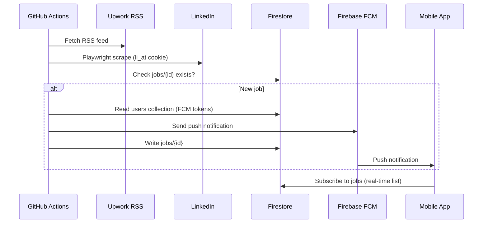

# Job Alert System

A **100% free** job alert stack that monitors **Upwork** (RSS) and **LinkedIn** (Playwright scraping), stores history in **Firebase Firestore**, and sends **FCM push notifications** to a **React Native** mobile app.

| Layer | Tech | Hosting |
|-------|------|---------|
| Cron / Backend | Node.js, Playwright, rss-parser, firebase-admin | GitHub Actions (every 15 min) |
| Database | Firestore (Spark free tier) | Firebase |
| Push | Firebase Cloud Messaging | Firebase |
| Mobile | React Native CLI | Your device |

---

## Repository Structure

```
Job-alert-system/
├── .github/
│   └── workflows/
│       └── cron.yml              # GitHub Actions cron (every 15 min)
├── backend/
│   ├── package.json
│   ├── .env.example
│   └── src/
│       ├── index.js              # Main entry — orchestrates fetch + notify
│       ├── config.js             # Environment variable loader
│       ├── fetchers/
│       │   ├── upwork.js         # RSS parser for Upwork jobs
│       │   └── linkedin.js       # Playwright scraper with li_at cookie
│       ├── firebase/
│       │   └── admin.js          # Firebase Admin SDK init
│       └── services/
│           ├── firestore.js      # Job dedup, token lookup, persistence
│           ├── notifications.js  # FCM multicast sender
│           └── jobProcessor.js   # Core dedup → notify → save loop
├── mobile/                          # React Native CLI app
│   ├── App.tsx                      # Root + notification handlers
│   ├── index.js                     # Entry + background FCM handler
│   ├── android/                     # Native Android project
│   ├── ios/                         # Native iOS project
│   ├── google-services.json.example
│   ├── GoogleService-Info.plist.example
│   └── src/
│       ├── components/
│       │   └── AlertItem.tsx     # Single alert card
│       ├── hooks/
│       │   └── useAlerts.ts      # Real-time Firestore subscription
│       ├── screens/
│       │   └── AlertsScreen.tsx  # FlatList of job alerts
│       ├── services/
│       │   ├── device.ts         # Device ID + token persistence
│       │   └── notifications.ts# FCM permission + handlers
│       └── types/
│           └── job.ts
├── firebase/
│   ├── firestore.rules           # Security rules
│   └── firestore.indexes.json    # Index for jobs.createdAt
└── README.md
```

---

## 1. Firebase Setup (Free Spark Plan)

### Create project
1. Go to [Firebase Console](https://console.firebase.google.com/) → **Add project**.
2. Stay on the **Spark (free)** plan.

### Enable Firestore
1. **Build → Firestore Database → Create database**.
2. Start in **production mode**, pick a region close to you.
3. Deploy rules from this repo:
   ```bash
   firebase deploy --only firestore:rules
   ```
   Or paste `firebase/firestore.rules` manually in the console.

### Enable Cloud Messaging
1. **Project Settings → Cloud Messaging**.
2. Note the **Sender ID** (used automatically by mobile SDK).

### Register mobile apps
1. **Project Settings → Add app → Android**
   - Package name: `com.jobalert`
   - Download `google-services.json` → place in `mobile/android/app/google-services.json`
2. **Add app → iOS**
   - Bundle ID: `com.jobalert`
   - Download `GoogleService-Info.plist` → add to `mobile/ios/JobAlert/` in Xcode

### Create service account (for backend)
1. **Project Settings → Service accounts → Generate new private key**.
2. Save the JSON file securely — you will store it as a GitHub Secret (see below).
3. **Do not commit this file.**

### Firestore collections (auto-created by the app)

| Collection | Document ID | Fields |
|------------|-------------|--------|
| `users` | device ID (e.g. `android_abc123`) | `fcmToken`, `platform`, `updatedAt` |
| `jobs` | sanitized job ID (e.g. `upwork:guid`, `linkedin:12345`) | `jobId`, `platform`, `title`, `link`, `company`, `location`, `createdAt`, `notifiedAt` |

---

## 2. Extract the LinkedIn `li_at` Cookie

The backend injects your LinkedIn session cookie to scrape job search results. This cookie expires periodically and must be refreshed.

### Steps (Chrome / Edge)
1. Log in to [linkedin.com](https://www.linkedin.com) in your browser.
2. Open **DevTools** (`F12`) → **Application** tab (Chrome) or **Storage** tab (Firefox).
3. In the left sidebar: **Cookies → https://www.linkedin.com**.
4. Find the cookie named **`li_at`**.
5. Copy its **Value** (a long alphanumeric string).

### Important
- Treat `li_at` like a password — anyone with it can access your LinkedIn session.
- Store it only in **GitHub Repository Secrets**, never in code or commits.
- When scraping stops working, re-extract and update the secret.
- LinkedIn may rate-limit or block automated access; use reasonable cron intervals.

---

## 3. GitHub Repository Secrets

In your GitHub repo: **Settings → Secrets and variables → Actions → New repository secret**

| Secret | Description | Example |
|--------|-------------|---------|
| `FIREBASE_SERVICE_ACCOUNT` | Entire service account JSON as **one line** | `{"type":"service_account","project_id":"..."}` |
| `UPWORK_RSS_URL` | Upwork RSS feed for your keyword search | See below |
| `LINKEDIN_SEARCH_URL` | LinkedIn job search URL with your filters | `https://www.linkedin.com/jobs/search/?keywords=react%20native&sortBy=DD` |
| `LINKEDIN_LI_AT` | LinkedIn session cookie value | `AQEDAT...` |
| `KEYWORD_FILTER` | *(Optional)* Extra client-side keyword filter | `react native` |
| `MAX_JOBS_PER_RUN` | *(Optional)* Cap jobs processed per run | `50` |

### Building the Upwork RSS URL
1. Go to [Upwork](https://www.upwork.com) and search for jobs with your keywords.
2. Apply filters (category, experience, etc.).
3. Append `/rss` to the search URL, or look for the RSS icon in the search results page.
4. Example:
   ```
   https://www.upwork.com/ab/feed/jobs/rss?q=react+native&sort=recency
   ```

### Storing `FIREBASE_SERVICE_ACCOUNT` as a secret
Minify the JSON to a single line (no line breaks):
```bash
# Linux/macOS
cat service-account.json | jq -c . | pbcopy

# PowerShell
(Get-Content service-account.json -Raw | ConvertFrom-Json | ConvertTo-Json -Compress)
```
Paste the result into the GitHub secret value field.

### Enable the cron workflow
GitHub disables scheduled workflows on **inactive** repositories. After pushing, run the workflow once manually:
**Actions → Job Alert Cron → Run workflow**.

---

## 4. Backend — Local Testing

```bash
cd backend
cp .env.example .env
# Edit .env with your real values
npm install
npx playwright install chromium
npm start
```

Expected output:
```
=== Job Alert Engine Started ===
[Upwork] Parsed N job(s) from RSS feed
[LinkedIn] Scraped N job(s)
[Processor] Saved and notified: LinkedIn — Senior React Native Developer
=== Job Alert Engine Finished ===
```

---

## 5. Mobile App Setup (React Native CLI)

```bash
cd mobile
npm install

# Add Firebase config (see mobile/README.md)
# android/app/google-services.json
# ios/JobAlert/GoogleService-Info.plist (via Xcode)

# iOS only (macOS)
cd ios && bundle exec pod install && cd ..

# Run
npm start
npm run android   # or npm run ios on macOS
```

### What the app does on startup
1. Requests notification permission (iOS + Android 13+).
2. Retrieves the FCM device token.
3. Saves the token to Firestore `users/{deviceId}`.
4. Subscribes to real-time updates on the `jobs` collection.
5. Handles notifications in **foreground**, **background**, and **quit** states.

### iOS extra step
In Xcode → JobAlert target → enable **Push Notifications** and **Background Modes → Remote notifications**. Upload APNs key in Firebase Console.

---

## 6. How It Works



---

## 7. Troubleshooting

| Problem | Fix |
|---------|-----|
| LinkedIn returns 0 jobs | Re-extract `li_at` cookie; verify `LINKEDIN_SEARCH_URL` works in your browser while logged in |
| `FIREBASE_SERVICE_ACCOUNT` parse error | Ensure JSON is valid single-line string in GitHub Secret |
| No push notifications | Confirm mobile app registered a token in `users` collection; check FCM is enabled |
| Cron not running | Manually trigger workflow; ensure repo has had activity in last 60 days |
| Firestore permission denied on mobile | Deploy `firebase/firestore.rules` |
| Playwright fails on GHA | Workflow already runs `npx playwright install --with-deps chromium` |

---

## 8. Cost Summary

| Service | Cost |
|---------|------|
| GitHub Actions | 2,000 min/month free (this job uses ~1 min per run ≈ 96 min/day max if every 15 min) |
| Firebase Spark | Free tier (Firestore + FCM) |
| Playwright on GHA | Included in Actions minutes |
| Mobile hosting | N/A — runs on your phone |

> **Note:** GitHub Free accounts get 2,000 Actions minutes/month. At 15-minute intervals (~2,880 runs/month × ~1 min), you may exceed the free tier. Consider running every 30–60 minutes if needed, or use a self-hosted runner.

---

## License

MIT — use and modify freely. Scraping LinkedIn may violate their Terms of Service; use at your own discretion.
